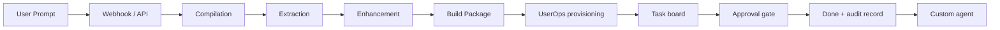

# Agent Backend — ROSTR control plane on AWS AgentCore

The backend that turns a plain-language request into a real project and gets it
done. Not an agent builder and not "just PAL": a request is compiled into a
build package, provisioned into a private AWS workspace, executed as tracked
work behind approval gates, and — when the work recurs — distilled into a
durable custom agent the artist owns.

Source specs: `Agent_Backend_Core.pdf`, `AWS_Backend_Infrastructure_AGENT.pdf`,
and the ROSTR stage diagrams.

---

## Request lifecycle



---

## ROSTR compile pipeline

Five stages, deterministic, in `src/lib/rostr/pipeline/`:

| Stage | Module | Responsibility |
|-------|--------|----------------|
| **PAL** | `pal.ts` | Compile prompt data (text, links, documents). Extract intent: goal, tools, use case. Draft enhanced Build Prompts. |
| **RAG-DAL** | `rag-dal.ts` | Documentation for every tool in the build; subject research (best practices, industry trends, foundational); the artist's own workspace sources. |
| **JTBD** | `jtbd.ts` | What is needed to complete the build; what the end product must execute. Marks consequential jobs approval-gated. |
| **NPAO** | `npao.ts` | Prioritize the jobs. Emit step-by-step instructions — what to do first and how. N→A→P→O. |
| **I.A.** | `ia.ts` | Design the architecture. Create Master Build Instructions and updated master system instructions. |

Run it: `POST /api/rostr/compile`

```bash
curl -X POST http://127.0.0.1:3000/api/rostr/compile \
  -H 'content-type: application/json' \
  -d '{"prompt":"Get my new single to music blogs next month"}'
```

Each compile persists under
`03-agent-workflows/compiles/{compile_id}/` so builds are reproducible and
auditable.

### Build package

Per the AWS Backend Infrastructure spec, every compile emits:

1. **PRD** — `prd.md`
2. **Soul.md** — existing soul, or seeded from the IA system instructions
3. **Tool Scripts** — `tool-scripts.json` (MCPs, Functions, Skills, Sub Agents)
4. **Build Prompts** — `build-prompts.json` (Skills, Functions/Tools, System Instructions, Misc)

---

## UserOps provisioning

`src/lib/userops/` — idempotent and resumable. State lives in
`00-config/provision-state.json`, so a failed run resumes from the failed step
rather than redoing everything.

| Step | What it does |
|------|--------------|
| `database` | USER# / PROJECT# / AGENT# control-plane records (DynamoDB, or hub-mirrored JSON) |
| `storage` | The canonical workspace tree — 17 folders, `00-config` → `05-agent-memory` |
| `compute` | Binds what powers the agent, where files live, and how data moves between agent and workspace |
| `agent_install` | Soul.md, tool scripts (MCP/function/skill/sub-agent), and the knowledge-base index over user knowledge + PAL/RAG-DAL outputs |

Run it: `POST /api/userops/provision` · status: `GET /api/userops/provision`

---

## AWS AgentCore

`src/lib/agentcore/` wraps Amazon Bedrock AgentCore. **Every capability is
independently env-gated and degrades gracefully** — the workspace runs fully
without any of them configured, which is what makes local dev work.

| Capability | Configured with | Falls back to |
|------------|-----------------|---------------|
| Runtime | `AGENTCORE_RUNTIME_ARN` | Bedrock inline invocation (pooled worker) |
| Memory | `AGENTCORE_MEMORY_ID` | `05-agent-memory/decisions.jsonl` in the hub |
| Identity | `AGENTCORE_WORKLOAD_NAME` | Platform IAM with server-side scope checks |
| Gateway | `AGENTCORE_GATEWAY_URL` | In-process tool registry |

Status: `GET /api/agentcore/status`

Memory is wired into `POST /api/agent/chat`: prior context is recalled before
the turn and the exchange is written back after it. Both are best-effort —
memory never breaks a chat turn.

### Tenant isolation

Memory actor id and namespace derive from `WorkspaceScope`, which is derived
server-side from the session and **never** from request input. One artist's
memory cannot be addressed from another workspace's scope.

---

## Task board and approval gates

`src/lib/rostr/task-board.ts` materializes the NPAO plan into tracked work.
Three rules are enforced in code, not convention:

1. Only declared status transitions are accepted.
2. An approval-gated task **cannot** reach `done` without passing through
   `approved` — verified by test, returns 409.
3. Approvals require a named actor taken from the verified session, and every
   decision is written to the immutable audit log.

Dependencies are enforced too: a task whose `depends_on` is unfinished cannot
start.

`GET /api/rostr/tasks` · `PATCH /api/rostr/tasks`

---

## Reference Hub

`src/lib/rostr/reference-hub.ts` — append-only records across four layers:

| Record | Path |
|--------|------|
| Decisions (approvals/rejections) | `05-agent-memory/decisions.jsonl` |
| Task summaries and artifacts | `05-agent-memory/performance-history.jsonl` |
| Immutable audit log | `04-deliverables/audit-log.jsonl` |

---

## Custom agents

`src/lib/rostr/agent-registry.ts` — the artist builds agents **by working**,
not by configuring. When a compile produces work they will need again, ROSTR
proposes an agent for it that inherits that build's tools, skills, and approval
gates.

An agent lands as `proposed` and needs explicit activation: a standing
capability in the workspace requires a human yes. Active agents are injected
into the Hermes system prompt so the Master Agent can route to them by name.

`GET|POST|PATCH /api/rostr/agents`

---

## Environment

```bash
# AgentCore (all optional — omit to use fallbacks)
AGENTCORE_REGION=us-east-1
AGENTCORE_RUNTIME_ARN=arn:aws:bedrock-agentcore:...:runtime/...
AGENTCORE_RUNTIME_QUALIFIER=DEFAULT
AGENTCORE_MEMORY_ID=...
AGENTCORE_WORKLOAD_NAME=artispreneur-agent
AGENTCORE_GATEWAY_URL=https://...

# Existing planes
HUB_BACKEND=fs|s3
S3_HUB_BUCKET=...
DYNAMODB_INSTANCE_TABLE=...
BEDROCK_MODEL_ID=deepseek.v3.2

# Local development without Cognito
AUTH_DEV_BYPASS=1
```

---

## Verified end-to-end

Against a running dev server with `AUTH_DEV_BYPASS=1` and **live Bedrock**
(`deepseek.v3.2`), running the full artist flow for a test artist:

- Dropped `artist-notes.md` into the vault → indexed and retrievable
- Rendered a Prompt Library opener → compiled to 10 NPAO steps
- RAG-DAL pulled the dropped file into build context
- Provisioning completed 4/4
- **Executor produced 9 real deliverables** (2,991–16,589 chars each), citing
  the dropped file and using the artist's actual voice, genre, and release date
- 8 safe tasks auto-completed; the outbound task stopped at `needs_approval`
  with *"Nothing has been sent, published, or filed."*

Earlier structural checks:

- ROSTR compile produced 9 NPAO steps and wrote all 6 artifacts
- UserOps provisioned all 4 steps; re-running skipped completed steps (idempotent)
- 17-folder workspace tree created
- Dependency blocking returned 409 on an unmet dependency
- Approval-gate bypass returned 409: *"is approval-gated and must be approved before it can be completed"*
- Legal path `in_progress → needs_approval → approved → done` succeeded and recorded the approver
- Custom agent built from the compile with inherited tools and gates
- 22 audit events written

---

## Not yet built

- **Composio integrations** — planned; no code yet
- **AgentCore Gateway targets** — config surface exists, targets not registered
- **RDS** — control plane is DynamoDB/hub JSON; RDS remains the blueprint target
