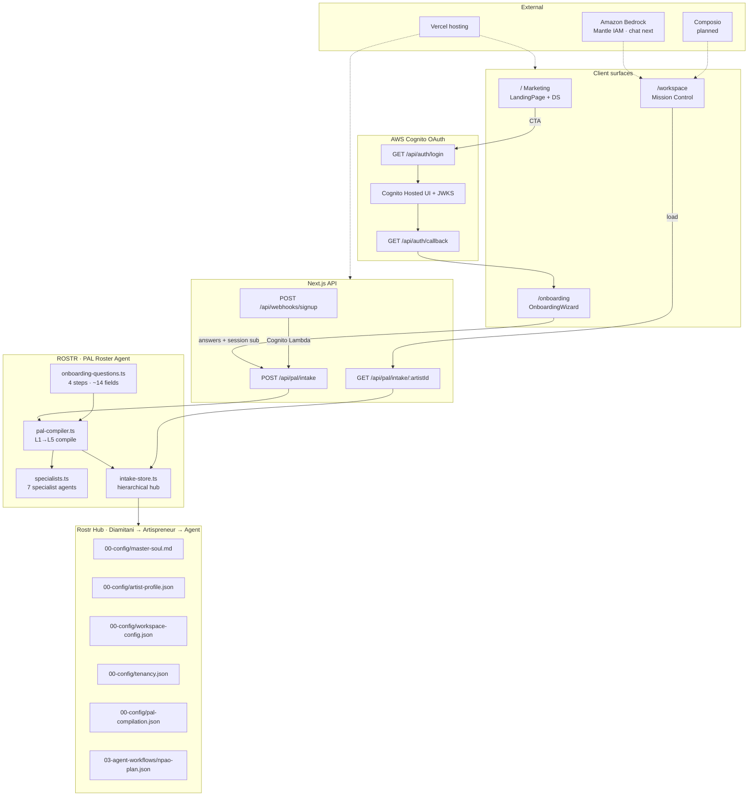
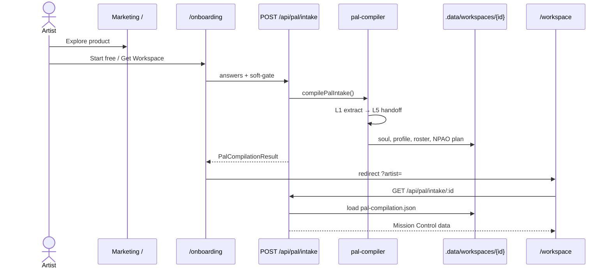
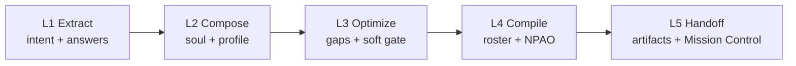
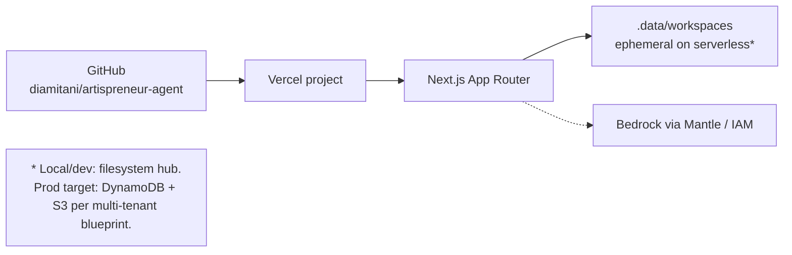

# Artispreneur Agent — Architecture

**Product:** Agent by Artispreneur  
**Stack:** Next.js 15 · React 19 · Tailwind 4 · ROSTR / PAL  
**Design system:** `design-system/` (v1.0) → runtime tokens in `src/app/globals.css`

---

## Workspace hierarchy (tenancy)

```
Diamitani Industries → artispreneur.com → agent → users/{sub} → projects/{id}
```

See `docs/AUTH.md` and `src/lib/tenancy/hierarchy.ts`.

## System overview



---

## User journey



---

## PAL compilation pipeline



| Stage | Output |
|-------|--------|
| L1 Extract | Structured answers, domain, constraints |
| L2 Compose | Draft Master Soul, artist profile |
| L3 Optimize | Completeness %, open gaps (soft gate) |
| L4 Compile | Active specialist roster, permissions, NPAO plan |
| L5 Handoff | Artifact paths, workspace ready |

---

## Specialist roster

| Specialist | Surface |
|------------|---------|
| Brand / EPK | Press kits, one-sheets |
| Contracts | Deal drafts, clause education |
| Release | Release readiness |
| Content | Social / brand assets |
| Press | PR outreach drafts |
| Booking | Venues, CRM |
| Finance | Budgets, statements |

Master Agent routes; specialists draft; **approval-first** for send / rights / money.

---

## Repo map

```
APP/
├── design-system/          # Brand DS v1.0 (tokens, kits, logo)
├── docs/
│   ├── ARCHITECTURE.md     # This file
│   └── PAL_INTAKE.md
├── .rostr/agents/          # Agent manifests
├── .data/workspaces/       # Local Rostr Hub (gitignored)
├── public/                 # Logo, hero
└── src/
    ├── app/                # Routes + API + globals.css tokens
    ├── components/
    │   ├── marketing/
    │   ├── onboarding/
    │   ├── workspace/
    │   └── brand/
    └── lib/
        ├── rostr/          # PAL compiler + store
        ├── brand.ts
        └── marketing-data.ts
```

---

## Deployment topology



---

## Design system binding

| Source | Runtime |
|--------|---------|
| `design-system/colors_and_type.css` | `src/app/globals.css` `:root` |
| Crimson `#CC0000` · Gold `#FED001` · Black `#111111` | CTAs, accents, dark heroes |
| Libre Baskerville + Inter | `layout.tsx` next/font |
| `design-system/assets/logo.png` | `public/artispreneur-logo.png` |
| Marketing / Dashboard UI kits | Landing + Mission Control patterns |

---

## Status legend

| Layer | Status |
|-------|--------|
| Marketing + DS | Shipped |
| Cognito OAuth + hierarchy | Shipped (env-gated) |
| PAL intake + soft gate | Shipped |
| Mission Control handoff | Shipped (light) |
| Bedrock DeepSeek Master Agent | Shipped (`/api/agent/chat`) |
| Workspace `apa_*` API keys + usage ledger | Shipped |
| Full Hermes shell (projects, vault) | Next |
| Composio integrations | Planned |
| Durable multi-tenant hub (DynamoDB/S3) | Planned (AWS blueprint) |
