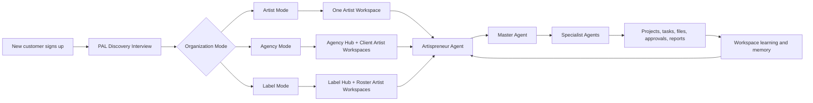
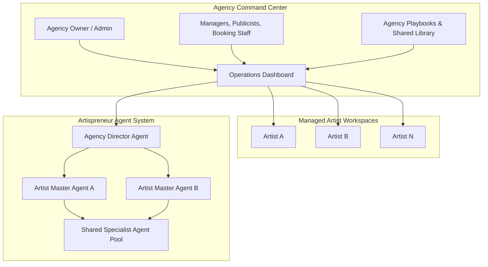

# Artispreneur Agent — Organization Modes (Artist · Agency · Label · Enterprise)

Artispreneur Agent is **one platform with three operating modes** — Artist, Agency, and
Label — plus a sales-led Enterprise tier. PAL determines the mode, organization structure,
permissions, active objectives, and agent workflow during onboarding. There are **not**
three separate products.

Scaling model: a shared multi-tenant platform for most customers, with a dedicated "silo"
deployment only for premium labels/agencies that require it (AWS SaaS Lens *bridge* model:
pooled shared services + dedicated resources only where genuinely needed).

---

## PAL as onboarding compiler

PAL is the product architect and configuration compiler. The user never sees PAL; they
complete onboarding and PAL creates an organization manifest, workspace structure, agent
roster, permissions, and a first 30-day execution plan.



**First discovery question:** "Which best describes how you work today: an independent
artist, an agency managing artists, or a record label managing a roster?"

| Mode | PAL must discover | PAL creates |
|------|-------------------|-------------|
| Artist | Career stage, genre, active release, priorities, team, assets, budget, brand, permissions | One workspace, Artist Soul.md, initial projects, Master Agent, enabled skills |
| Agency | Services, staff roles, client roster, approval process, client access, shared templates, reporting cadence | Organization Hub, Agency Soul.md, client-workspace template, Agency Director Agent, staff roles |
| Label | Roster size, divisions, release volume, distribution process, rights documents, approvals, campaign budgets | Organization Hub, Label Soul.md, roster-workspace template, Label Director Agent, release calendar |
| Enterprise | Security/compliance, SSO, custom roles, data residency, dedicated compute, integrations, SLAs | Enterprise policy manifest, deployment requirements, custom integration plan |

---

## Product hierarchy

```
Artispreneur Agent Platform
│
├── Organization
│   ├── Organization profile and plan
│   ├── Billing, credits, integrations, and policy
│   ├── Shared knowledge and approved templates
│   ├── Team members, roles, and permissions
│   └── Organization Command Center
│
├── Artist Workspace            (strict private boundary — see WORKSPACE_FLOW.md)
│   ├── Artist Soul.md · memory · preferences
│   ├── Projects: releases, tours, EPK, campaigns, finance
│   ├── Artist assets and knowledge vault
│   ├── Agent tasks and deliverables
│   └── Approval history
│
├── Artispreneur Agent          (Master + specialists)
├── Skills                      (EPK builder, pitch writer, release plan, contracts, …)
└── Libraries                   (vault, org playbooks, Academy, contracts, directories, prompts)
```

**Key design rule:** an organization *owns* artist workspaces, and each artist workspace
remains a strict private boundary inside that organization. An agency sees only artists
explicitly assigned to it; a label manages strategy centrally while each artist accesses
only their own workspace.

---

## Mode comparison

| Capability | Artist | Agency | Label |
|------------|--------|--------|-------|
| Primary tenant | One artist | Agency organization | Label organization |
| Artist workspaces | One | Many client artists | Many roster artists |
| Master Agent | Personal manager-style agent | Agency operations director | Label roster operations director |
| Workspace Soul.md | Artist-generated | Per artist + agency playbook | Per artist + label strategy |
| Shared knowledge | Artispreneur resources | Agency processes, case studies, templates | Label standards, release playbooks, brand rules |
| Team roles | Artist, optional collaborator | Owner, admin, manager, publicist, contractor, client artist | Owner, label admin, A&R, marketing, PR, distribution, artist |
| Approvals | Artist approves outbound | Agency manager and/or client artist | Label policy + assigned artist/team |
| Reporting | Personal next actions + project progress | Portfolio workload, client status, campaign performance | Roster release calendar, budgets, catalog and campaign health |
| Isolation | Workspace boundary | Org boundary + workspace boundary | Org boundary + workspace boundary |
| Premium compute | Rarely needed | Optional | Optional / dedicated enterprise tier |

---

## Agency mode — "Artispreneur Agent for Agencies"

A **portfolio command center**, not a larger artist dashboard.



### Agency Director Agent

Organization-level orchestrator. It does **not** impersonate an artist or overwrite
artist-specific brand instructions.

Responsibilities:
- Workload, campaign status, approvals, deadlines, blocked work across assigned client workspaces
- Weekly agency operating brief: releases due, outreach in progress, overdue approvals, missing client assets, at-risk tasks
- Assign staff or specialist-agent capacity across clients
- Apply the agency's approved outreach, reporting, and brand processes
- Generate client-ready reports from workspace data
- Escalate decisions to the assigned manager or artist when approval is needed

Must not:
- Send client communications or external outreach without the configured approval route
- Access an artist workspace unless the artist is assigned to the agency org and staff member
- Blend confidential data from one client into another client's workspace

---

## Label mode — "Artispreneur Agent for Labels"

Manages a roster, release calendar, shared standards, campaign budgets, and artist-specific
execution — without losing each artist's independence.

### Label Roster Director

- Roster-wide release calendar and conflict alerts
- Release readiness scorecards per artist
- Tracks missing assets, metadata, rights documentation, distribution status, approved budgets, campaign approvals
- Executive summaries by artist, campaign, and release cycle
- Coordinates shared PR, marketing, content, and distribution capacity
- Preserves artist-level voice, goals, and permissions through separate Artist Soul.md files

**v1 scope note:** do not build catalog royalty accounting or automated rights
administration. Ship an operational catalog + rights *document vault* only; integrate
specialist systems later.

---

## PAL output manifest (organization)

```yaml
organization:
  id: org_uuid
  type: agency          # artist | agency | label
  name: "Example Music Group"
  plan: enterprise
  deployment_tier: pooled   # pooled | bridge | dedicated
  billing_owner_user_id: user_uuid

governance:
  approval_mode: client_approval_required
  data_retention_policy: enterprise_standard
  audit_logging: true
  custom_branding: true
  sso_enabled: false

team:
  roles:
    - organization_owner
    - organization_admin
    - manager
    - publicist
    - booking_manager
    - finance_manager
    - contractor
    - artist_member
    - viewer

shared_context:
  organization_soul: "org/agency-soul.md"
  shared_libraries:
    - agency_playbooks
    - approved_pitch_templates
    - reporting_templates
    - artispreneur_academy
  permitted_integrations: []

artist_workspace_template:
  required_documents:
    - artist-soul.md
    - brand-profile.md
    - active-goals.md
    - permissions.yaml
    - release-plan.md
  required_projects: [release, brand_epk, outreach]
  default_agents: [artispreneur_master, epk_brand, pr_outreach, release_manager]

agents:
  organization_agents: [agency_director, portfolio_reporting]
  artist_agents: [artispreneur_master, epk_brand, pr_outreach, release_manager]

approval_routes:
  outreach_send:
    required_approvers: [assigned_manager, artist_member]
  budget_change:
    required_approvers: [organization_owner]
  publishing:
    required_approvers: [assigned_manager, artist_member]
  legal_document:
    required_approvers: [organization_owner, artist_member]
```

---

## Tier-based infrastructure

One platform design; isolation and capacity selected by customer tier — not distinct
codebases.

| Tier | Customer | Compute | Storage and access | Best use |
|------|----------|---------|--------------------|----------|
| Artist | Independent artist | Shared pooled workers | Workspace-scoped files, DB records, retrieval filters | MVP + self-serve plans |
| Agency | Multi-client manager | Shared pooled workers, priority queues | Org + assigned-workspace permissions | Standard agency plan |
| Label | Roster operations | Pooled workers, optional reserved capacity | Org + artist workspace + rights-document scopes | Label plan |
| Enterprise | Major agency/label | Bridge or dedicated worker environment | Optional dedicated storage/index/keys, SSO, audit export | Compliance, high volume, custom integrations |

### Required enterprise security controls

- Organization, workspace, project, and document IDs on every record and agent event
- Role-based **plus assignment-based** access: a manager sees only explicitly assigned artist workspaces
- Policy engine validating workspace scope before every retrieval, memory read/write, tool call, and query
- Organization-level shared libraries separated from artist-private libraries
- Full audit logs: access, outputs, approvals, external actions, integration events
- Signed, short-lived file downloads
- Per-organization encryption keys as a later enterprise add-on
- Dedicated compute/index only when paid for or contractually required

Isolation is not achieved by authentication alone — tenant context must be enforced across
resource access, including shared resources (AWS SaaS Lens).

---

## Naming system

| Product level | Name in UI | Backend role |
|---------------|-----------|--------------|
| Core assistant | Artispreneur Agent | Hermes Master Agent + ROSTR control plane |
| Artist manager | My Artispreneur Agent | Workspace-scoped Master Agent |
| Agency coordinator | Agency Director | Organization-level orchestration agent |
| Label coordinator | Roster Director | Label-level orchestration agent |
| Agent team | Your Business Team | Registered specialist agents |
| Tools | Skills | On-demand Hermes/Artispreneur workflows |
| Shared content | Knowledge Vault | ROSTR Reference Hub + approved libraries |
| Task dashboard | Mission Control | Agent runs, task state, approvals, activity |

**Do not market "Hermes" or "ROSTR" as user features.** Positioning: *"Artispreneur Agent
gives independent artists, agencies, and labels a private AI business team — with one
command center for every artist, release, task, and approval."*

---

## Build sequence

1. **Artist mode first** — Master Agent, EPK/Brand, PR/Outreach, Release Manager, approval
   queue, projects, knowledge vault.
2. **Add the organization data model immediately**, even while launch serves artists only —
   prevents an expensive rebuild when agencies join.
3. **Agency mode next** — staff roles, artist assignments, shared playbooks, client
   approvals, Agency Director dashboard.
4. **Label mode as an Agency extension** — roster release calendar + rights-document views.
   Not a separate app.
5. **Enterprise as a sales-led tier** — bridge/dedicated isolation only when a customer's
   needs justify the operational overhead.

Checkpoints: `#artist-mode-defined` `#organization-model-defined`
`#agency-director-specified` `#label-roster-model-defined`
`#pal-enterprise-compiler-ready` `#tenant-isolation-required`
