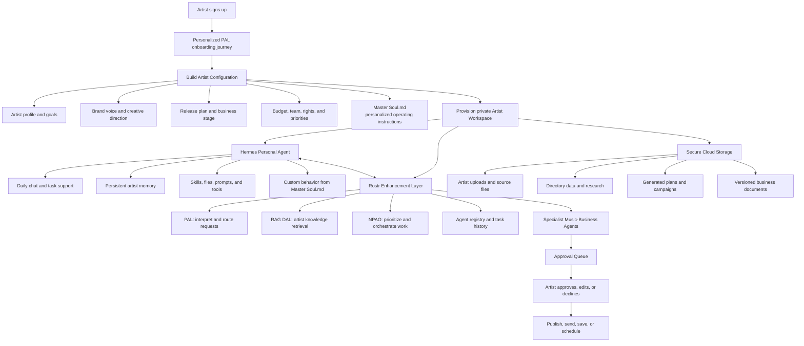
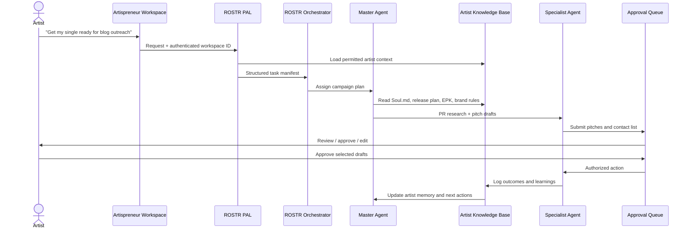

# Artispreneur Agent Workspace — Canonical Flow

Source of truth for the workspace concept: onboarding → artist context → provisioning →
Hermes runtime → Rostr control plane → guided business-building. Complements
`docs/ARCHITECTURE.md` (what is shipped) with the full product spec (where it is going).

---

## Corrected concept transcription

> A user signs up for the platform and receives a **PAL-compiled onboarding journey**
> relevant to their app experience. From that output, several **brand prompts, PRDs, and a
> Master Soul.md** file are created.
>
> A **personalized workspace** is provisioned to hold data and files related to the
> knowledge base, scripts, and user inputs. The **Hermes agent is configured for that
> artist's workspace**, with custom authentication, memory, skills, and agent configuration.
>
> The user then uses the app to build their business or explore other sections, such as
> skills, agent workflows, and content folders.

Terminology note: "PAL-compiled" and "SSM configuration" were interpreted from handwritten
notes. **PAL** is confirmed product terminology (see `.rostr/agents/pal-roster.yaml`).
"SSM configuration" resolves to per-workspace Hermes agent configuration (auth, memory,
skills, secrets) — not AWS Systems Manager as a user-facing term.

---

## Workspace flow



**MVP loop:** sign-up → onboarding → workspace provisioning → artist context generation →
agent access → guided business-building workflows.

Key architecture decision: **do not deploy a separate EC2/Hermes server per artist.** Use a
shared, containerized multi-tenant runtime with strict workspace authorization; dedicated
isolated compute is an enterprise add-on only (see `docs/ORG_MODES.md`).

---

## Roles: Hermes vs Rostr

| Layer | Role | User-facing? |
|-------|------|--------------|
| **Hermes** | Artist's personalized day-to-day agent: chat, memory, skills, files, Soul.md-driven behavior | Yes — branded "Artispreneur Agent" |
| **Rostr** | Hidden control plane: PAL intent compilation, RAG DAL retrieval, NPAO orchestration, agent registry, Reference Hub | No — backend infrastructure only |

The **Artispreneur Master Agent** is the branded, artist-facing Hermes agent. The user never
chooses an agent first; the Master Agent understands the request, asks only needed
questions, and delegates specialist work through Rostr.

### Example task flow



---

## Workspace structure (logical)

Canonical per-artist layout. The shipped hub maps this under
`orgs/diamitani-industries/tenants/artispreneur-com/products/agent/users/{sub}/projects/{id}/`
(see `docs/AWS_INSTANCE.md`); the numbered folders below are the contract.

```
/artispreneurs/{artist-id}/
├── 00-config/
│   ├── master-soul.md
│   ├── artist-profile.json
│   ├── brand-system.md
│   ├── permissions.yaml
│   └── active-goals.md
├── 01-knowledge-base/
│   ├── music-and-artist-assets/
│   ├── courses-and-guides/
│   ├── contracts-and-templates/
│   ├── outreach-directories/
│   └── approved-reference-material/
├── 02-business-operations/
│   ├── releases/  campaigns/  pr-and-media/
│   ├── booking/   finance/    legal-and-rights/
├── 03-agent-workflows/
│   ├── content-pipeline.yaml
│   ├── release-campaign.yaml
│   ├── media-outreach.yaml
│   └── venue-booking.yaml
├── 04-deliverables/
│   ├── drafts-awaiting-approval/
│   ├── approved/
│   └── sent-or-published/
└── 05-agent-memory/
    ├── decisions.jsonl
    ├── preferences.json
    └── performance-history.jsonl
```

---

## Workspace Configuration Object

Each artist gets a **Workspace Configuration Object**, not a generic Hermes install. Hermes
loads it at the start of every task; Rostr agents reference it when they collaborate.

| Configuration area | What it stores | Example |
|--------------------|----------------|---------|
| Artist identity | Name, genre, location, audience, social links, EPK assets | "Chicago R&B artist; emerging independent act" |
| Business stage | Current priorities and maturity | "Preparing first EP release in 10 weeks" |
| Brand system | Voice, visual direction, story, do/don't rules | "Warm, self-assured, soulful; no corporate language" |
| Goals and KPIs | Measurable career outcomes | "Book 3 Midwest dates; 25 press placements" |
| Release operating plan | Releases, dates, assets, campaign status | "Single 1: master due Aug 1, release Sep 12" |
| Permission policy | What agents can draft, schedule, publish, send | "Draft outreach freely; approval before sending" |
| Knowledge sources | Trusted files, courses, templates, directories | EPK, press photos, Artispreneur playbooks |
| Agent roster | Activated specialists and responsibilities | PR, booking, finance, content, distribution |
| Cost and model policy | Model routing, credits, limits, escalation | Low-cost model for drafts; premium for strategy |

### Schema

```yaml
workspace:
  id: ws_uuid
  artist_id: artist_uuid
  status: active
  plan: founder

identity:
  artist_name: ""
  legal_business_name: ""
  location: ""
  genres: []
  stage: emerging
  team_members: []

brand:
  story: ""
  voice_attributes: []
  visual_direction: ""
  prohibited_language: []
  canonical_links: {}

goals:
  current_90_day_goals: []
  current_release:
    title: ""
    release_date: null
    campaign_status: planning
  business_priorities: []

permissions:
  external_communications: approval_required
  publishing: approval_required
  financial_actions: prohibited
  legal_actions: draft_only
  connected_accounts: []

context:
  soul_file: s3://private-path/master-soul.md
  active_projects: []
  enabled_agents: [master, epk_brand, pr_outreach, release_manager]
  enabled_skills: []
  enabled_libraries: []

governance:
  model_budget_monthly_usd: 0
  daily_task_limit: 0
  retention_policy: standard
  audit_logging: true
```

---

## Rostr agent spec (workspace hub)

```yaml
hub:
  namespace: artispreneurs/{artist-id}
  storage: aws-s3-plus-database
  auth: true
  multi_user: false

artist_workspace:
  config_source: 00-config/
  context_files:
    - 00-config/master-soul.md
    - 00-config/artist-profile.json
    - 00-config/brand-system.md
    - 00-config/active-goals.md
  default_mode: approval-required

agents:
  - name: Artispreneur Master Agent
    type: orchestrator
    runtime: hermes
    description: >
      The artist's daily business partner. Maintains context, clarifies
      goals, creates plans, and delegates work to specialist agents.
    capabilities: [artist-business-strategy, task-planning, agent-routing, progress-tracking]
    tools: [file_system, ragdal, task_board, agent_registry, approval_queue]
    context_required:
      - 00-config/master-soul.md
      - 00-config/artist-profile.json
      - 00-config/permissions.yaml

  - name: PR and Outreach Agent
    type: specialist
    capabilities: [media-research, pitch-writing, campaign-management]
    tools: [ragdal, directory_search, email_draft, approval_queue]

  - name: Release Manager
    type: specialist
    capabilities: [release-planning, distribution-checklists, metadata-review, deadline-management]

  - name: Booking Manager
    type: specialist
    capabilities: [venue-research, routing, booking-outreach, follow-up-management]

modules:
  pal: true
  ragdal: true
  npao: true
  dashboard: true
  approval_queue: true
  audit_log: true
```

---

## Tenant isolation rules

1. Every request carries authenticated user + workspace context, **derived server-side from
   the session** — never accepted from a browser field.
2. Every database table carries `workspace_id` with row-level access enforced server-side.
3. Every S3 object lives under a tenant/workspace prefix:
   `tenants/{tenant_id}/workspaces/{workspace_id}/...`.
4. Every retrieval chunk carries metadata: tenant, workspace, library, project, document,
   sensitivity, permission scope.
5. Every agent task runs with a scoped policy token limited to one workspace and approved tools.
6. Every external action requires approval, with approver, final payload, timestamp,
   connected account, and outcome logged.
7. No direct raw S3 access; only short-lived signed links after authorization.

---

## AWS scale design (target)

| Layer | Implementation | Why |
|-------|----------------|-----|
| Web | Next.js frontend (Vercel or AWS-hosted) | Fast Claude Code-like responsive workspace |
| Auth | Cognito (current); centralize tenant checks at API | Avoid rebuilding signup/user management |
| API | Containerized API behind gateway/load balancer | Central authorization + tenant checks |
| Agent execution | ECS/Fargate worker services — not one VM per user | Scale tasks independently of the web app |
| Hermes runtime | Container image loaded by workers for active jobs | Standardized config, isolated work |
| ROSTR layer | Control-plane service: PAL, NPAO, registry, retrieval policy | Preserves routing/orchestration logic |
| Workflow queue | Managed queue + event bus | Long agent work never blocks the UI |
| App data | Postgres (Supabase now, managed later) / DynamoDB `USER#` (shipped) | Users, workspaces, projects, tasks, billing |
| Raw files | Private S3 by tenant/workspace prefix | Uploads, outputs, backups |
| Search index | Vector DB or Postgres vector extension | Permission-filtered retrieval |
| Secrets | AWS Secrets Manager; runtime env injection only | Keys never in workspace documents |
| Observability | Central logs, traces, immutable audit events | Debugging, billing reconciliation, trust |
| Backups | Versioned S3 + DB backups with recovery tests | Protects artist files and records |

---

## MVP build order

1. **Define `master-soul.md` and the artist configuration schema** — the personalization
   foundation every agent depends on. *(#onboarding-defined — lock the onboarding
   questions and exact Soul.md schema first.)*
2. **Build onboarding that fills the schema** — progressive questions: identity, goals,
   brand, active release, team, assets, approval permissions. *(Shipped: `docs/PAL_INTAKE.md`.)*
3. **Launch one Master Agent + three specialists** — Brand/EPK, PR & Outreach, Release
   Manager. Not the entire roster at once.
4. **Approval-first workflow** — all external communication, publishing, spending, and
   legal changes remain drafts until explicit approval.
5. **Connect Artispreneur's proprietary assets** — blog/playlist/media directories, courses,
   prompt libraries, contract templates become governed knowledge sources with separate
   permissions for sensitive legal/financial material.
6. **Add Mission Control** — task boards, knowledge browsing, agent registry, activity
   timeline, performance analytics.

Checkpoints: `#onboarding-defined` `#workspace-architecture-defined`

---

## Related docs

- `docs/ARCHITECTURE.md` — shipped system + PAL pipeline
- `docs/PAL_INTAKE.md` — onboarding endpoint + artifacts
- `docs/AWS_INSTANCE.md` — shipped multi-tenant hub (fs/S3 + DynamoDB)
- `docs/ORG_MODES.md` — Artist / Agency / Label / Enterprise modes
- `docs/BUILD_PROMPTS.md` — agency build prompts (ROSTR, Hermes, Frontend) + delivery plan
